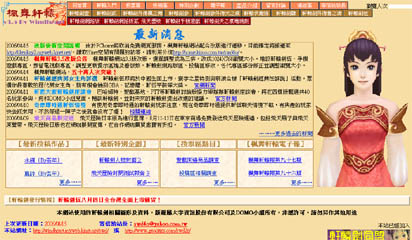
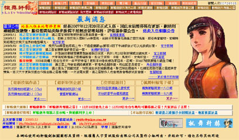

## 本站改版沿革
 

::: timeline V3.5
- 因應軒轅劍伍所進行的改版，主要是將上排選單調整成為三排，改成1024X768瀏覽大小。增設軒轅劍伍、手機遊戲專區，預留電視劇專區，更新提示區塊配合版娘拉大而稍微上移。(2006.8.14) 
 

 

:::

::: timeline V3.0
- 網站更名為「楓舞軒轅」，首頁選單全部改至上方，上方選單全面改成圖片，首頁新增四專區更新提示區塊。 網站全色系統一，並且蒼之濤化，修正網站的導覽與介紹，新增報紙功能，部分區域合併，軒網功能撤除。(2004.8.30) 
 

 

:::

::: timeline V2.02
- 因應奇摩本站跟hi-net分站全面復站的改版，取消下拉式連結框，投稿區改成粉紅色系。(2003.8.7)之後並針對3.0改版做了一些提前修改，並配合開設蒼之濤區，投稿區討論區進行翻修。(2003.11.26)
 

:::

::: timeline V2.01
- 對於2.0所做的一點小小更動，主要是取消讀取速度過慢的內建框架。(2003.6.1) 
 

:::

::: timeline V2.0
- 創站以來首度的大改版，取消了所謂首頁的設計，並且所有的左列選項都改為框架頁，全面增設背景音樂。網站logo放置於左上，並且將選單擴大成為兩排。設立看板娘模式，新聞採用內建框架的方式。 連結區增設消失網站，併設立關於本站的站務內容，投稿區也做小幅更動。(2002.8.28) 
 

 

:::

::: timeline V1.05
- 事實上只是2.0版的緩衝版本，也可以說是為了軒網區改的版。調整了若干的檔名，更換了不少背景，連結區都改為表格方式，比較整齊。(2002年7月30日)
  

 

:::

::: timeline V1.04
因應新年改的版，把左側的連結改成有顏色變化的，上方的底色換掉，首頁改成楓葉與劍的圖樣。(2002年2月12日)期間雖然有增加軒轅劍肆區，但是整體並沒有改變，不算改版。
  

 

:::

::: timeline V1.03
時間最長的版本，把最上方的圖示連結換成比較方便的文字連結，左側的連結也作了變動和修正，大概放了七個月。(2001年7月29日)
  

 

:::

::: timeline V1.02
- 主要是配合增加軒轅伏魔錄區，整個網站色系又改過了。(2001年3月3日)
- 期間辦過一次首頁票選活動，把首頁換成輔子徹和紋錦的圖樣。(2001年4月26日)
 
 

:::

::: timeline V1.01
- 把網站的色系作調整過了，也確立了1.0版的架構。(2001年1月28日)
 
 

:::

::: timeline V1.0
- 這是最早的版本，整個網站色系是全黑的，事實上這個版本沒有多少人看過，因為開站之後只放了十天就被換掉了。(2001年1月17日)
:::
