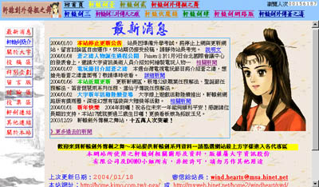

# 本站看板娘历程
 

本站设置看板娘由来已久，也形成了一个颇受欢迎的文化，有鉴于许多玩家希望自己喜欢的角色当上看板娘，所以对看板娘的选任相当有兴趣。特别是一直想知道本站用过哪些轩辕剑人物当作看板娘，自己喜欢的轩辕剑人物还能不能登场。 
虽然本站曾经在电子报第109期做过一次回顾，但是用电子报回顾会有无法更新的问题，所以站长这别撰写这篇文章，替大家整体回顾本站放置过的看板娘。 
 

::: timeline 轩辕剑六“蓉霜”2015年3月1日
- 本次因为站务长期停摆，又相当久一段时间没有换看板娘，因此站长又再换了一次看板娘，挑选了轩辕剑六的蓉霜担任。而且因为后续站务持续停摆，蓉霜就这样放了一年多，大约22个月。
 
 

:::

::: timeline 轩辕剑六女主角“瑚月” 2013年6月16日
- 本次伴随著枫舞轩辕进行了4.0的改版，也一併更换了看板娘，由于这时候轩辕剑陆正要上市，站长也就把看板娘换成了六代的女主角瑚月。但由于后续站务停摆，瑚月就这样留在首页很长的时间，放了大概20个月。
 
 

:::

::: timeline 飞天历险、崑崙镜Web“困敦镜王” 2012年12月31日
- 本次因为站长发现看板娘未按时在七月更换，年底才急急忙的立刻换掉，刚好此时崑崙镜Web封测，就趁热把困敦镜王放上来了。
 
 

:::

::: timeline 轩辕剑外传云之遥“舒莞儿” 2012年1月1日
- 本次的看板娘也是延续2010年的看板娘玩家票选，依据该次票选第四名决定的，当时舒莞儿获得9.7%的选票。而且因为站长忘记换下，舒莞儿就这样待了一年。
 
 

:::

::: timeline 轩辕剑外传云之遥“玉澧” 2011年7月23日
- 本次的看板娘也是延续2010年的看板娘玩家票选，依据该次票选第三名决定的，当时玉澧获得12%的选票。不过因为站长事务繁忙，本次并没有按半年一次的规律，在7月1日准时更换。
 
 

:::

::: timeline 轩辕剑外传云之遥“芝茵” 2010年1月1日
- 本次的看板娘是延续2010年的看板娘玩家票选，依据该次票选第二名决定的，当时芝茵获得28%的选票。
 
 

:::

::: timeline 轩辕剑外传云之遥“兰茵” 2010年7月1日
- 本次的看板娘结果，是依照2010年举办玩家票选看板娘的第一名决定的，当时兰茵获得46%的选票。
 
 

:::

::: timeline 轩辕剑外传汉之云“端蒙” 2010年1月1日
- 本次的看板娘结果，是依照2009年那次玩家票选看板娘的第二名决定的，当时端蒙获得约17%的选票。
 
 

:::

::: timeline 轩辕剑外传汉之云“赤衣” 2009年7月4日
- 本次的看板娘也是少数透过玩家票选决定的，在强敌多半已经当过看板娘的状况下，赤衣以获得36%的选票获选本次看板娘。
 
 

:::

::: timeline 轩辕剑外传汉之云“横艾” 2008年12月17日
- 虽然这次的看板娘原先站长已经决定是横艾，但是站长特别留言板上甄询版友，请大家共同讨论要用哪一张图，最后赵诚瑞版本的横艾获得最多支持，是少数在留言板决定的看板娘。
 
 

:::

::: timeline 轩辕剑外传汉之云“耶亚希‧芭娜” 2008年1月1日
- 这次由于碰到站长当兵，耶亚希也意外的当了很久的看板娘，待了将近一年的时光。
 
 

:::

::: timeline 轩辕剑伍“莫耶” 2007年9月1日
- 因为配合夏柔跟小白都比较晚换上，延迟至九月才换上莫耶，后来因为希望重新调整看板娘的更换期限，莫耶到2008年元旦又匆匆被换掉，是目前以来最短寿的看板娘。
 
 

:::

::: timeline 轩辕剑肆“小白” 2007年2月15日
- 由于之前等轩辕剑伍发行，打破了原本较为固定的看板娘更换时间，因此这次刻意的把更换看板娘的时间延后，避免夏柔当看板娘的时间太短。这次站长只是基于开玩笑而把小白放上来，本来没打算久放，结果访客都觉得很有趣，于是就放了满长的一段时间。而这也是历代看板娘中，少数的非人族看版娘。
 
 

:::

::: timeline 轩辕剑伍“夏柔” 2006年8月15日
- 本次的看板娘更换，主要是搭配轩辕剑伍发行，当时网站也因为轩辕剑伍的发行进行了3.5的改版，所以刻意等待了一下，等轩辕剑伍发行才更换看板娘。
 
 

:::

::: timeline 轩辕剑贰“江如红” 2005年7月1日
 

:::

::: timeline 轩辕剑外传苍之涛“嬴诗” 2005年1月1日
 

:::

::: timeline 轩辕剑外传苍之涛“车芸” 2004年7月1日
- 车芸担任看板娘期间，经历了8月30日的3.0版大改版，是少数途中有经历过大改版的看板娘。因为碰上改版加上图片又不太满意，站长更换过好几次车芸的图片，包含王福生版本、3D正面版、3D侧面版一共三个版本，因此车芸也是所有看板娘之中，换过最多次图片的看板娘。 顺道一提，车芸也是第一位经由本站玩家票选决定出来的看板娘。
 
 

:::

::: timeline 轩辕剑参外传“拓跋玉儿” 2004年1月1日
 

:::

::: timeline 轩辕剑参外传“于小雪” 2003年6月1日
 

:::

::: timeline 轩辕剑参“妮可” 2003年1月17日
- 这次的看板娘更换，主要是搭配本站两週年站庆更换的，原本使用了轩辕剑参平面广告的2D图，但是画质却感觉不是很好，所以几週之后，就换成轩辕剑参某张桌布上的Q版妮可，是少数有换过图的看板娘。
 
 

:::

::: timeline 轩辕剑肆“水镜” 2002年8月28日
- 由当时刚发行的轩辕剑肆女主角“水镜”担任看板娘
 
 

:::

::: timeline 2002年8月28日
- 本站进行2.0改版，首次设置看板娘
:::