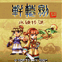

# 轩辕剑之水镜传说

   

 

<table border="0" width="100%">
  <tbody><tr>
    <td width="15%" ><b>游戏名称</b></td>
    <td >轩辕剑之水镜传说</td>
  </tr>
  <tr>
    <td width="15%" >
    <b>游戏类型</b></td>
    <td >RSLG</td>
  </tr>
  <tr>
    <td width="15%" >
    <b>发行商</b></td>
    <td >大宇资讯　（简体版由北京拉阔代理）</td>
  </tr>
  <tr>
    <td width="15%" ><b>价格</b></td>
    <td >新台币70元</td>
  </tr>
  <tr>
    <td width="15%" ><b>发行时间</b></td>
    <td >2006年7月17日</td>
  </tr>
  <tr>
    <td width="15%" ><b>简介</b></td>
    <td >
    大宇公司PC经典游戏“轩辕剑4”的手机SLG版本！游戏中，玩家需要根据自己所掌握的兵种，地形等因素，充分发挥兵种相剋的特性，做出最为正确的判断，达到胜利过关要求。让玩家以SLG的形式，重温轩辕剑的经典魅力。</td>
  </tr>
  <tr>
    <td width="15%" ><b>游戏画面</b></td>
    <td >

   

    </td>
  </tr>
  <tr>
    <td width="15%" ><b>操作指令</b></td>
    <td >
    ★↑ or 数字〔2〕=往上移动 
    ★↓ or 数字〔8〕=往下移动 
    ★← or 数字〔4〕=往左移动 
    ★→ or 数字〔6〕=往右移动 
    ★JOYSTICK=决定 
    ★SOFTKEY 1=设定 
    ★SOFTKEY 2=离开游戏／返回／选单</td>
  </tr>
  <tr>
    <td width="15%" ><b>支援手机</b></td>
    <td >
    Dopod 565, Dopod 585, Motorola C381 
    Motorola C381p, Motorola C650, Motorola V180 
    Motorola V188, Motorola V220, Motorola V226 
    Motorola E375, Motorola E398, Motorola E770 
    Motorola PEBL U6, Motorola RAZR V3i, Motorola SLVR L7 
    Motorola V360, Motorola V361, Motorola V600i 
    Motorola V635, Motorola V80, Motorola V975 
    Motorola V300, Motorola V303, Motorola V501 
    Motorola V600, Nokia 2650, Nokia 2652 
    Nokia 3100, Nokia 3108, Nokia 3120 
    Nokia 3129, Nokia 3200, Nokia 3220 
    Nokia 3300, Nokia 5140, Nokia 6020 
    Nokia 6021, Nokia 6030, Nokia 6060 
    Nokia 6100, Nokia 6101, Nokia 6102 
    Nokia 6103, Nokia 6108, Nokia 6111 
    Nokia 6125, Nokia 6170, Nokia 6220 
    Nokia 6230, Nokia 6610, Nokia 6610i 
    Nokia 6820, Nokia 7200, Nokia 7210 
    Nokia 7250, Nokia 7250i, Nokia 7260 
    Nokia 7270, Nokia 7360, Nokia 3230 
    Nokia 3250, Nokia 6260, Nokia 6600 
    Nokia 6630, Nokia 6670, Nokia 6680 
    Nokia 7610, Nokia N70, Nokia N91 
    Panasonic X700, Panasonic X800, Sony Ericsson K310i 
    Sony Ericsson K500i, Sony Ericsson K510i, Sony Ericsson Z520i 
    Sony Ericsson Z530i, SonyEricsson W300i, Sony Ericsson K600i 
    Sony Ericsson K608i, Sony Ericsson K610i, Sony Ericsson K700i 
    Sony Ericsson K750i, Sony Ericsson W550i, Sony Ericsson W700i 
    Sony Ericsson W800i, Sony Ericsson W810i, Sony Ericsson Z800i 
    Sharp GX-T15, Sharp GX-T17, Sharp GX-T25 
    Motorola E1000, Motorola E1070, Motorola RAZR V3x 
    Sharp WX-T71, Sharp WX-T91, Samsung SGH-D508 
    Samsung SGH-D528, Samsung SGH-E618, Samsung SGH-E628 
    Samsung SGH-E738, Samsung SGH-P738, Samsung Z308</td>
  </tr>
  <tr>
    <td width="15%" ><b>官方下载</b></td>
    <td >
    <a href="http://web.gamecool.com.tw/Game.asp?game_id=Sword4">下载连结页面</a></td>
  </tr>
  </tbody></table>
  

