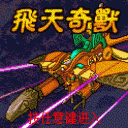

# 飞天奇兽

 

 

<table border="0" width="100%">
  <tbody><tr>
    <td width="15%" ><b>游戏名称</b></td>
    <td >飞天奇兽</td>
  </tr>
  <tr>
    <td width="15%" >
    <b>游戏类型</b></td>
    <td >动作冒险</td>
  </tr>
  <tr>
    <td width="15%" >
    <b>发行商</b></td>
    <td >大宇资讯　（简体版由北京拉阔代理）</td>
  </tr>
  <tr>
    <td width="15%" ><b>价格</b></td>
    <td >新台币70元</td>
  </tr>
  <tr>
    <td width="15%" ><b>简介</b></td>
    <td >
    这是一个纵版的射击类游戏，战斗画面精彩，又有多项攻击技能供玩家运用，玩家控制威力巨大的机关鸢在天空翱翔，与各种机怪兽周旋战斗。每一关都有新颖的BOSS战斗，不容错过﹗</td>
  </tr>
  <tr>
    <td width="15%" ><b>游戏画面</b></td>
    <td >
    

 

    </td>

  </tr>
  <tr>
    <td width="15%" ><b>操作指令</b></td>
    <td >
    【←】【4】向左移动 
    【→】【6】向右移动 
    【↑】【2】向上移动 
    【↓】【8】向下移动 
    【1】支援攻击 
    【3】防护模式</td>
  </tr>
  <tr>
    <td width="15%" ><b>支援手机</b></td>
    <td >
    Motorola C381, Motorola C381p, Motorola C650 
    Motorola V180, Motorola V188, Motorola V220 
    Motorola V226, Motorola E375, Motorola E398 
    Motorola E770, Motorola PEBL U6, Motorola RAZR V3i 
    Motorola SLVR L7, Motorola V3, Motorola V360 
    Motorola V361, Motorola V3i, Motorola V600i 
    Motorola V80, Motorola V975, Motorola V300 
    Motorola V303, Motorola V303p, Motorola V501 
    Motorola V600, Nokia 3129, Nokia 6060 
    Nokia 6101, Nokia 6102, Nokia 6103 
    Nokia 6111, Nokia 6125, Nokia 6170 
    Nokia 7260, Nokia 7270, Nokia 7360 
    Nokia 2650, Nokia 2652, Nokia 3100 
    Nokia 3108, Nokia 3120, Nokia 3200 
    Nokia 3220, Nokia 3300, Nokia 5100 
    Nokia 5140, Nokia 6020, Nokia 6021 
    Nokia 6030, Nokia 6100, Nokia 6108 
    Nokia 6220, Nokia 6230, Nokia 6610 
    Nokia 6610i, Nokia 6800, Nokia 6820 
    Nokia 7200, Nokia 7210, Nokia 7250 
    Nokia 7250i, Nokia 7600, Nokia 3230 
    Nokia 3250, Nokia 6260, Nokia 6600 
    Nokia 6630, Nokia 6670, Nokia 6680 
    Nokia 7610, Nokia N70, Nokia N91 
    Panasonic X700, Panasonic X800, Sony Ericsson K310i 
    Sony Ericsson K500i, Sony Ericsson K510i, Sony Ericsson Z520i 
    Sony Ericsson Z530i, SonyEricsson W300i, Sony Ericsson K600i 
    Sony Ericsson K608i, Sony Ericsson K610i, Sony Ericsson K700i 
    Sony Ericsson K750i, Sony Ericsson W550i, Sony Ericsson W700i 
    Sony Ericsson W800i, Sony Ericsson W810i, Sony Ericsson Z800i 
    Sharp GX-T15, Sharp GX-T17, Sharp GX-T25 
    Sharp GX-T29, Motorola E1000, Motorola E1070 
    Motorola RAZR V3x, Sharp WX-T71, Sharp WX-T91</td>
  </tr>
  <tr>
    <td width="15%" ><b>官方下载</b></td>
    <td >
    <a href="http://web.gamecool.com.tw/Game.asp?game_id=Flying">下载连结页面</a></td>
  </tr>
  </tbody></table>

