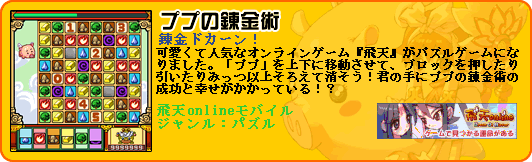

# 噗噗炼金术

 

<table border="0" width="100%">
  <tbody><tr>
    <td width="15%"  rowspan="2"><b>游戏名称 
	 
　</b></td>
    <td ><b>ププの錬金术</b></td>
  </tr>
  <tr>
    <td >【中译】噗噗炼金术</td>
  </tr>
  <tr>
    <td width="15%" >
    <b>游戏类型</b></td>
    <td >益智</td>
  </tr>
  <tr>
    <td width="15%" >
    <b>发行商</b></td>
    <td >Gamania Japan／株式会社ガマニアデジタルエンターテインメント 
	（日本游戏橘子）</td>
  </tr>
  <tr>
    <td width="15%" ><b>价格</b></td>
    <td >购买日本游戏橘子的行动手机服务即可游玩，包月每月315日圆</td>
  </tr>
  <tr>
    <td width="15%" ><b>发行时间</b></td>
    <td >2006年7月12日</td>
  </tr>
  <tr>
    <td width="15%" ><b>简介</b></td>
    <td >

 
</td>
  </tr>
  <tr>
    <td width="15%" ><b>游戏画面</b></td>
    <td >
    <a-image src="../../../public/img/games/mobi/mobi006.jpg" width="180" />
     <a-image src="../../../public/img/games/mobi/mobi006_1.jpg" width="180" />
      <a-image src="../../../public/img/games/mobi/mobi006_2.jpg" width="180" />
    
 
　</td>
  </tr>
  <tr>
    <td width="15%" ><b>支援手机</b></td>
    <td >
    
	
	DoCoMo 505 506 700 701 702 703 900 901 902 903</td>
  </tr>
  <tr>
    <td width="15%" ><b>官方页面</b></td>
    <td >
    <a target="_blank" href="http://www.gamania.co.jp/mobile/">下载连结页面</a></td>
  </tr>
  </tbody></table>