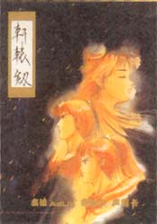

 

# 游戏介绍

第一部中国武侠RPG诞生

  <a-space direction="vertical" size="large" fill>
    <a-descriptions :data="data" layout="inline-vertical" bordered/>
</a-space>

自盘古开天辟地后，女娲神创造了人族与魔族，因性格与外表的不同，两族常起冲突。后来人类铸造了一把神器－轩辕剑，企图彻底解决两族间的战争。持有此剑的侠士带领人类与魔族战得两败俱伤。十七年后，主角离开教他仙法多年的师父下山历练，面对这世上的纷争，期待一个能让自己活跃的舞台。

 

◎大宇第一套ＲＰＧ游戏，全国首套中文古典中国风味游戏，震撼当时游戏界

◎充满现代节奏感之中国音乐，古朴中不失张力，典雅裡内敛伏笔，奠下尔后中国风游戏典范

◎流畅细腻的动画，影音的紧密结合，开拓当时自制游戏的新领域

