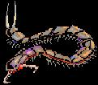

# 敌方角色

## 朝阳县原野
| 怪物名称 | 奖励道具    |奖励经验值   |怪物图鉴 |
| ---- | ---- |----|----|
|蝙蝠	|赏金2   |1	  |   |
|巨鼠	|赏金2   |2	  |   |
|巨蝙蝠  |赏金4   |2   |   |
|毒蚕	|赏金8   |3   |   |
|毒蛾	|赏金8   |3   |   |
|蜥蜴	|赏金20  |3   |   |
|磁蛙	|赏金10  |4   |   |
|沼气	|赏金10  |4   |   |

## 朝阳县水井
| 怪物名称 | 奖励道具    |奖励经验值   |怪物图鉴 |
| ---- | ---- |----|----|
|飞鱼|赏金13|5|  |
|泥怪|赏金15|5|  |
|魔女头|赏金39|6|  |
|水妖|赏金20|7|  |
|人鱼|赏金15|7|  |
|鱼魔|赏金18|8|  |

## 朝阳县西边原野
| 怪物名称 | 奖励道具    |奖励经验值   |怪物图鉴 |
| ---- | ---- |----|----|
|鬼火|赏金25|	9| |
|骸骨|赏金25|	10| |
|妖火|赏金30|	10| |

## 朝阳县西边洞穴
| 怪物名称 | 奖励道具    |奖励经验值   |怪物图鉴 |
| ---- | ---- |----|----|
|蛇　群	|赏金25|	14||
|食人花	|赏金25|	13||
|毒　蛟	|赏金30|	18||
|风　魔	|赏金25|	14||
|邪　鬼	|赏金30|	15||
|雷　鬼	|赏金35|	20||
|魔　藤	|赏金25|	13||
|菇　精	|赏金30|	20||

## 长春镇原野
| 怪物名称 | 奖励道具    |奖励经验值   |怪物图鉴 |
| ---- | ---- |----|----|
|武　者	|赏金32	|20||
|吸血虾	|赏金40	|19||
|蜈　蚣	|赏金30	|19||
|鼹　鼠	|赏金31	|19||
|蟒　蛇	|赏金40	|19||
|形　天	|赏金45	|25||

## 凤凰塔（一到三层）
| 怪物名称 | 奖励道具    |奖励经验值   |怪物图鉴 |
| ---- | ---- |----|----|
|灵道士	|赏金45	|24||
|魔火	|赏金43	|24||
|凶猫	|赏金45	|22||

## 凤凰塔（四到六层）
| 怪物名称 | 奖励道具    |奖励经验值   |怪物图鉴 |
| ---- | ---- |----|----|
|炎兽	|赏金57	|35||
|活死人	|赏金50	|30||
|人头蛇	|赏金55	|500||

## 凤凰塔（七到九层）
| 怪物名称 | 奖励道具    |奖励经验值   |怪物图鉴 |
| ---- | ---- |----|----|
|凶猫|赏金45|22| |	
|死灵卫兵|赏金100 战利品许愿杖|100| |

## BOSS(魔王)
| 怪物名称 |出现地点|怪物描述|建议等级| 奖励赏金    |奖励经验值 |法术 |怪物图鉴 |
| ---- | ---- |----|----| ---- | ---- |----|----|
|老虎精	|朝阳县衙|老虎经多年修练后成精，会幻化成人形，嗜食人|12	|500|144|无	|<a-image src="../../../public/img/games/swd1/swdboss1.jpg" alt="老虎精" />|
|蜘蛛精	|朝阳县西边洞穴	|蜘蛛经多年修练后成精，能迷惑人类，定身后将其捕食|16|----|-----|定身|<a-image src="../../../public/img/games/swd1/swdboss2.jpg" alt="蜘蛛精" />|
|小倩	|凤凰塔顶	|自小被妖怪捉入塔中，因被下了咒，有时会疯狂乱攻击|22|0|999|霜箭、寒风	|<a-image src="../../../public/img/games/swd1/swdboss3.jpg" alt="小倩" />|
|火凤凰	|长春镇客栈	|受恶神指示，伪装成店小二杀害镇民，并毒害主角|25|10000|10000|炽火、气还	|<a-image src="../../../public/img/games/swd1/swdboss4.jpg" alt="火凤凰" />|

★製表、抓图、資料整理：风城之心
