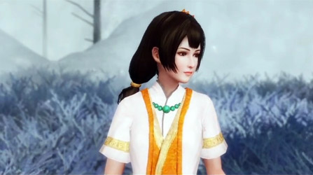
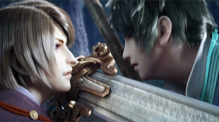
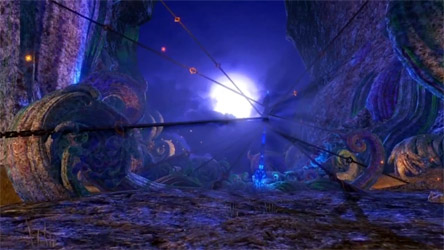
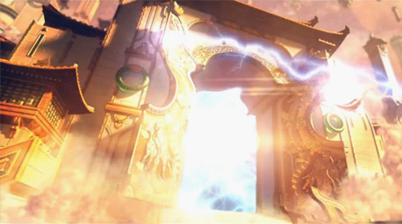
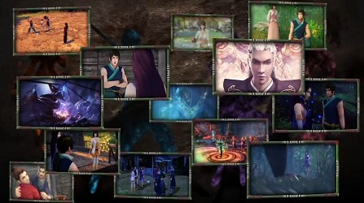

## 宣传动画
### 第一部宣傳動畫
<b>動態豐富光影自然</b> 

<a-image src="@images/games/qzf/mv001.jpg" />

（<a href="https://www.youtube.com/watch?v=BHyLy_eSgrU" target="_blank">Youtube觀看</a>）

### 第二部宣傳動畫
<b>顛覆重生，即時作戰來襲</b> 

（<a href="https://www.youtube.com/watch?v=7a4Iu5_QA-s" target="_blank">Youtube觀看</a>）

### 第叁部宣傳動畫
<b>上古之謎，重生之旅</b>
 

（<a href="https://www.youtube.com/watch?v=VzxYe5gmYpk" target="_blank">Youtube觀看</a>）

### 第四部宣傳動畫
<b>場景採用全新光照系統，人物動態捕捉真實自然</b>
 

（<a href="https://www.youtube.com/watch?v=970wybzApvU" target="_blank">Youtube觀看</a>）

### 第五部宣傳動畫
<b>登蒼穹啟天門、解開塵封千載的上古之謎</b>
 

（<a href="https://www.youtube.com/watch?v=Lr5s3AWSg18" target="_blank">Youtube觀看</a>）

### PS4版宣傳動畫
<b>2016年台北電玩展版本</b>
 

（<a href="https://www.youtube.com/watch?v=5sKqYej46PI" target="_blank">Youtube觀看</a>）

## 官方其他影片

## 桌布下載

## 遊戲配樂試聽

## 其他相關影片

