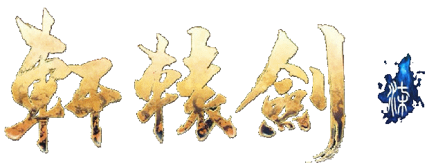
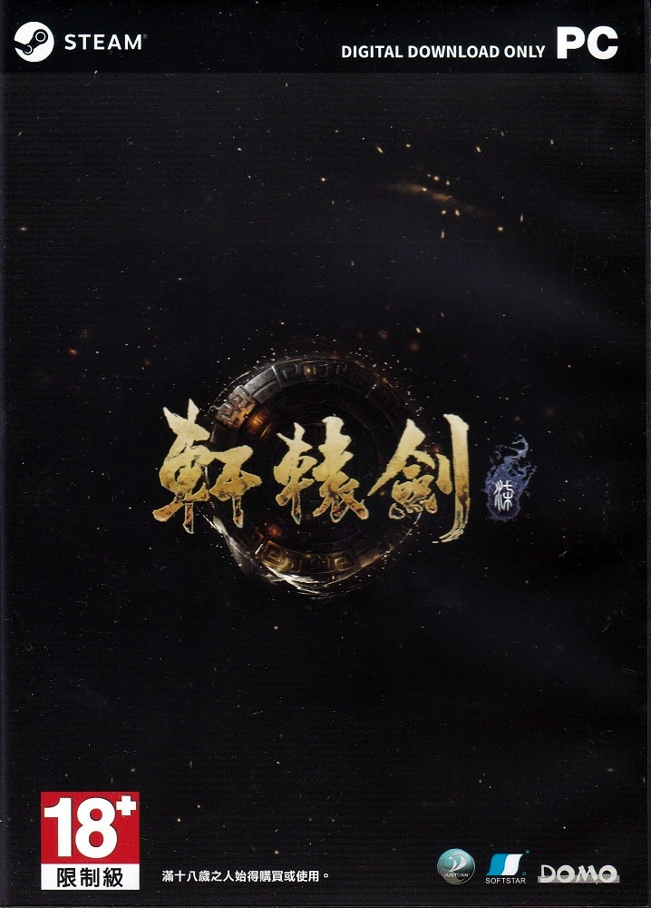
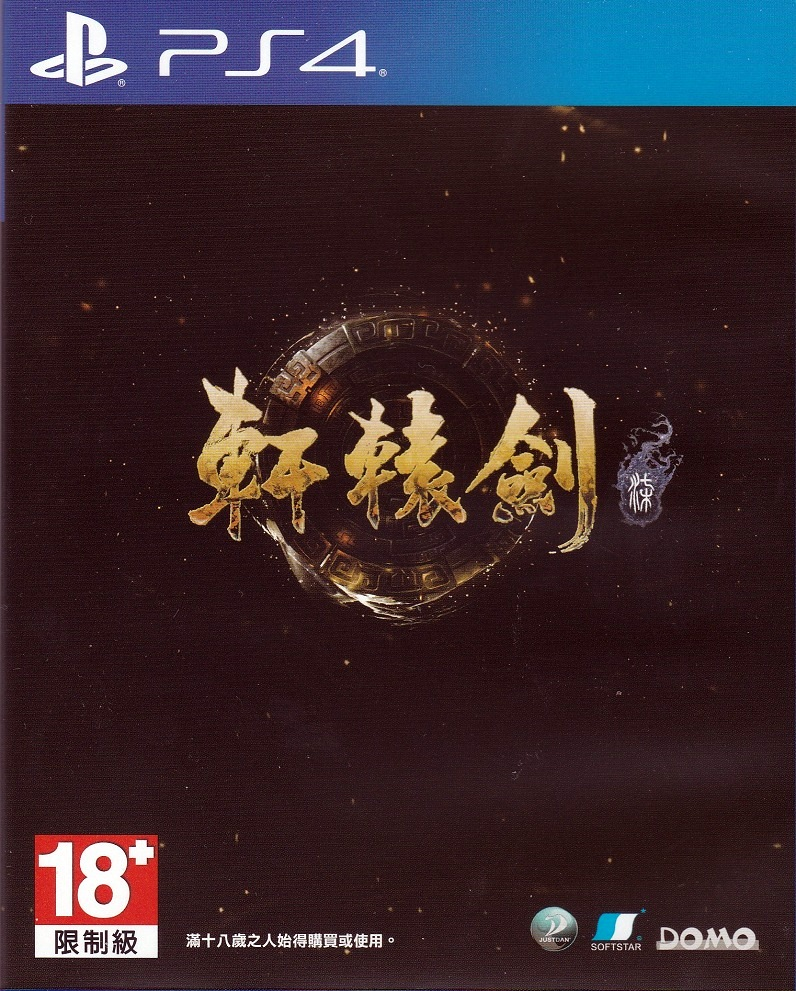

# 游戏介绍
 

## 故事介绍
《軒轅劍柒》是一款即時制角色扮演遊戲，亦是經典RPG系列《軒轅劍》的最新單機作品。 
玩家將扮演遺孤太史昭，在動盪的西漢末年，為保護家人，踏上斬妖除魔、追尋真相之路。 
西漢末年，王莽代漢而立，國號為「新」。時年，石文現，石牛出，古墓開，各種符命與異兆紛呈。 
留侯墓出土了一片奇特的竹簡，連夜送交太史令。沒想到，當竹簡送達以後，當夜竟離奇失火，太史令滿門盡亡，竹簡也不翼而飛。 
十年過去了，符命與異兆所預言的太平盛世並沒有到來。連年天災人禍導致民不聊生，百姓苦不堪言，各地紛紛揭竿而起。就在此時，消失十年的竹簡再度出現了，掀起一陣波瀾…… 

## 遊戲特色

### 戰鬥系統全面革新
《軒轅劍柒》將採用動作性更強的即時制戰鬥模式。 
連招、武技、閃避、格擋、反擊等戰鬥要素一應俱全，帶來更為暢快的戰鬥體驗 

### 不一樣的天書系統

系列經典元素「天書」以新的面貌登場，並在太史昭的冒險歷程中提供多種機能： 
**「天書之力」** ——戰鬥中可以發動，短時間內大幅提升 
**「收妖」「煉化」** ——玩家可借助天書之力收伏妖魔，作為煉化的素材；煉化不僅會產生新的妖魔，更有機率生成御魂，強化太史昭自身能力 
**「神兵」「天衣」「神兵」「機關」「聚靈」** ——多種設施齊聚天書世界，提供武器強化、防具打造、飾品製作、禦魂培養等不同功效機關科技再現，墨家重返舞臺。
《軒轅劍肆》之後，墨家機關術再度登上舞臺。 
曾一度與儒家比肩的顯學——墨家，經歷西漢後更趨衰落。派系分歧愈演愈烈，傳承已久的信仰再次受到挑戰。 
墨家會在亂世中徹底分崩離析，還是重新走向振興之路？將由玩家親自見證。 

### 虛幻4打造 再現亂世百態

《軒轅劍柒》採用全新引擎打造，整體畫質相比歷代作品將有質的飛躍，帶領玩家進入西漢末年的中原大地。 
PC版還將支援NVIDIA的光線追蹤技術，讓場景更加真實。 

### 全新動捕技術 演出規格提升
引入全新動作捕捉系統，運用更豐富的演出手段，演出效果及人物刻畫更上一層樓。豐富的人物神情，流暢的角色動作，讓遊戲故事更加生動。 

## 系統需求

<table>
<tr>
<td>產品名稱</td>
<td>軒轅劍柒</td>
</tr>
<tr>
<td>適用平台</td>
<td>PC（Steam）、PS4、XBox（包括Xbox Series X|S、Xbox One）</td>
</tr>
<tr>
<td rowspan="8">最低配置</td>
<td>需要 64 位元的處理器及作業系統</td>
</tr>
<tr>
<td>作業系統: Windows 7 / Widows 8 / 10（64位元）</td>
</tr>
<tr>
<td>處理器: Intel Core i5 4590或AMD等同性能處理器</td>
</tr>
<tr>
<td>記憶體: 8 GB 記憶體</td>
</tr>
<tr>
<td>顯示卡: NVIDIA GTX 960或其他廠牌同性能顯示卡</td>
</tr>
<tr>
<td>DirectX: 版本：11</td>
</tr>
<tr>
<td>儲存空間: 50 GB 可用空間</td>
</tr>
<tr>
<td>音效卡: Direct Sound 相容音效卡</td>
</tr>
<tr>
<td rowspan="8">推荐配置</td>
<td>需要 64 位元的處理器及作業系統</td>
</tr>
<tr>
<td>作業系統: Windows 7 / Widows 8 / 10（64位元）</td>
</tr>
<tr>
<td>處理器: Intel Core i7 7700或AMD等同性能處理器（含以上）</td>
</tr>
<tr>
<td>記憶體: 16 GB 記憶體</td>
</tr>
<tr>
<td>顯示卡: NVIDIA RTX2060 或其他廠牌同性能顯示卡</td>
</tr>
<tr>
<td>DirectX: 版本：11</td>
</tr>
<tr>
<td>儲存空間: 50 GB 可用空間</td>
</tr>
<tr>
<td>音效卡: Direct Sound 相容音效卡</td>
</tr>
</table>

## 官方網站

|说明|地址|
|---|---|
|軒轅劍柒官網(繁中)|http://www.swd7.tw/|
|軒轅劍柒官網(簡中)|https://swd7.cn/index.html|
|steam頁面|https://store.steampowered.com/app/1249800/|
|PS Store頁面|https://store.playstation.com/product/HP3256-CUSA23482_00-XUANYUANSWORD007|
|Wegame頁面|https://www.wegame.com.cn/store/2001380/|

　

## 上市日期
 
<a-timeline mode="alternate" labelPosition="relative">
<a-timeline-item label="2020年10月29日">
Steam版本（繁體、簡體中文、英文）、PS4版本（繁體、簡體中文、韓文、英文）同步發售
</a-timeline-item>
<a-timeline-item label="2020年12月10日">
PS4日文版發售
</a-timeline-item>
<a-timeline-item label="2021年8月5日">
Wegame版本發售
</a-timeline-item>
<a-timeline-item label="2021年9月30日">
PS4歐美版發售、XBox歐美版發售 （新增法文、德文、西班牙文、俄文、土耳其文）
</a-timeline-item>
<a-timeline-item label="2022年1月13日">
PS4中國區發售
</a-timeline-item>
<a-timeline-item label="2022年5月27日">
XBox台灣區發售
</a-timeline-item>
</a-timeline>

::: tip 说明
※以上XBox版本，係支援Xbox Series X|S、Xbox One
:::

## 售價

|版本|大陆地区|台湾地区|其他地区|
|---|---|---|---|
|Steam版|¥99元|＄1080元|香港299港幣|
|Wegame版|¥99元|||
|PS4版|¥199元|＄1280元|香港：318港幣 韓國：56000韓元 日本：6380日圓 美洲區：49.99美元 歐洲區：44.99歐元|
|XBox版||＄1279元|美洲區49.99美元|

※以上售價均為基礎版本，不包含原聲帶與設定集