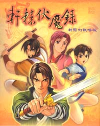
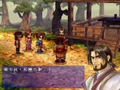
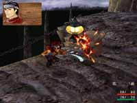

# 游戏介绍

  <a-space direction="vertical" size="large" fill class="block w-full">
    <a-descriptions :data="data" layout="inline-vertical"/>
</a-space>

<strong style="color: #FBA300;font-size:20px;">纯朴的墨门少年，该如何仗剑伏魔、平服乱世？</strong> 

<a-image src="../../../public/img/games/fml/04.jpg" width="280px" />

<a-image src="../../../public/img/games/fml/05.jpg" width="280px" />

<a-image src="../../../public/img/games/fml/06.jpg" width="280px" />

<a-image src="../../../public/img/games/fml/07.jpg" width="280px" />

炼妖壶，一只封镇群妖的上古法器。 
墨者，一群武艺精湛、崇尚古风的义士，世代承担著守护炼妖壶的重责。 
神器与侠士的结合？传说的探索‧‧‧ 
故事从轰隆巨响，流光洩地的惊惶之中展开。少渊峰山脚的一场骤变，出外历练的少年侠客竟然遇上重大而从所未有的人生变故！ 
师门被灭，宝壶失落；百姓遭殃，恩人遇害。这少年终究预料不到一次下山之旅，竟会变成一段沉长艰辛的伏魔征途！面对师门的血仇，和恩人的死难，少年的稚脱单纯似乎早已随著变异掩埋其间，只剩得万般凝重的长剑和仇怨，一刹时，却在自己身上叠加了下来。携同孤苦无依的恩人之女，少年无可如何，只有两人懵懂的踏上路途。 
幸好旅途终非寂寞。落草为寇的豪门娇女、中州成名的大镖头、纵横西北草上飞、传奇剑客、仙谷灵狐，以及离世索居的憨厚少年，这些人背负著怨愤、伤痛，义气与仇忾，侠义相聚，红尘同往。 
前程有许多知的变数，对手有许多狡狯的谋画。这群人甚至不甚明白前途究竟会在哪裡终结？只能且摸且走，寻途向前。路上除见得群妖为祸之外，又且恶官扰民、贪神变节。这是一个什麽样的世界？众人总是不住摇头。然而这伙人至少还有对于世事最纯然的信服，为他们带来无数地动力，为彼此砥砺美好的未来。 
虽说群妖祸世，英雄应生，但是此去如何？毕竟难料。只能依侍著同伴们的热情，风雨同路。群妖祸世，正是英雄应生。这一切，也将随著一柄上古神兵─轩辕剑─的现世，逐渐地清晰明朗…… 
近来以中国为时空背景的ＲＰＧ游戏类型来说，总是选择改朝换代、兵荒马乱的剧情，就像看部“历史游戏电子书”，而没有明显时空背景的“轩辕伏魔录”，在这方面有了一大突破，没有了历史的包袱，给了研发小组更大的创意空间，相对地，对玩家来说，也回归到“玩游戏”的单纯动机。 
不过，既是“轩辕剑”系列作品，玩家门耳熟能详的“炼妖壶”、“轩辕剑”当然仍是重心，而整个故事起缘则与“轩辕剑贰”有较大的关联性，选择“墨者”来连贯轩辕剑的精神。 
有深度的剧情一向是DOMO在轩辕剑系列的特色，在这一次的《轩辕伏魔录》中，DOMO特别商请《仙剑奇侠传》与《霹雳奇侠传》的仙剑小组担任编剧的顾问，让《轩辕伏魔录》的剧情演出更显精彩可期。 
 
<strong style="color: #FBA300;font-size:20px;">轩辕剑系列　首次开发R.SLG游戏类型</strong> 

<a-image src="../../../public/img/games/fml/08.jpg" width="280px" />

<a-image src="../../../public/img/games/fml/09.jpg" width="280px" />

“轩辕剑”是国产自制游戏中，相当少见的系列作品。而轩辕剑所创立的武侠RPG游戏类型，也带动了国内这类题材的热潮，至今不衰。而向以RPG为游戏类型的轩辕剑，其实早有制作以轩辕剑为题、非RPG类型的游戏，只是万事具备、只欠东风罢了。 
R.SLG游戏类型顾名思义，结合了角色扮演、及战略游戏的特色，所以“轩辕伏魔录”游戏进行方式可分为“村庄模式”与“战斗模式”。在村庄模式中，主角一人行走，玩家在此进行买卖道具、执行任务、补血、与路人互动等，如同一般的角色扮演游戏，目的在于提昇主角的经验值。 
而“战斗模式”则以回合制进行游戏，则是依循故事情节，并非随机发生，因此玩家们千万别忽视剧情的发展、及每一场战斗，否则，将陷入苦战中，得不到旅途中的友情支援了！ 
“轩辕伏魔录”与其他战略游戏不同的地方，就是玩家可随自己的喜好，使用360度可旋转视角，或调整距离的远近，并非仅有两三个视觉角度，而且，此并不侷限于战斗模式或村庄模式中，所以，玩家将可发现研发小组在方面的用心了。 
在轩三之后，DOMO除了积极开发“天之痕”外，又另外投入一组人力，研究发展次世代的3D游戏引擎。在经过日夜不眠不休的努力后，终于成功研发出DOMO的新一代3D游戏技术。在战斗中，玩家可以任意旋转视角，并选择是点距离及角度，除了剧情模式外，我们不会强制控制视角，玩家不用再为了玩个游戏而去买晕车药了。 
 
<strong style="color: #FBA300;font-size:20px;">独家罩门战斗系统　蛮干不再是获胜的不二法门</strong> 

<a-image src="../../../public/img/games/fml/10.jpg" width="280px" />

<a-image src="../../../public/img/games/fml/11.jpg" width="280px" />

战略游戏的根本，就是战斗。《轩辕伏魔录》是一个回合制的战略游戏，这样的设计，让您在面临敌军时，可以更从容的运筹帷幄。 
“金、木、水、火、土”五行属性之间的相生相剋，衍生了“轩辕伏魔录”的战斗系统，在战斗中造成的影响，可从面临危机转变为轻易获胜。当然也可能会遭遇更惨的失败。因此，活用各种不同属性的法术与道具，才是致胜的不二法门。	 
此外，在战场中还有所谓的五行风水属性存在，这样的风水属性，也会对角色的攻防能力有所影响，这便延伸出DOMO要让战略游戏更有变化的全新‘五行时间轮系统’，战斗中，画面上有一个圆形的轮盘，会依照敌我双方角色的行动时间分别转到不同的属性位置，和五行相生相剋一样，当转到对火属性有利的位置时，不论敌我，身上有火属性的角色都会加强能力。 
因此，在对每一个角色下达指令的同时，也要考虑到轮盘转动后对战斗的影响，如此将更富战略性，让战斗过程更生刺激。 
<strong style="color: #FBA300;font-size:20px;">丰富多变的我方角色</strong> 

在《轩辕伏魔录》中，我方共会有高达８个角色。在战斗中，各自有不同的攻击特性及属性。有人擅长远距离攻击，有人擅长近距离直攻，也有人擅长后勤辅助，像这样各式的战斗特性，玩家必须运用得法，方能在战场中达势如破竹之效。

<strong style="color: #FBA300;font-size:20px;">召唤兽造型劲爆　来头皆有考据</strong> 

玩家在游戏中如果完成某些特殊任务，就可以得到召唤兽的青睐，之后的战斗，玩家便可召唤牠们出来协助主角攻击敌人。每隻召唤兽均有相当劲爆的造型，不过却也秉持轩辕剑的制作要求，每隻召唤兽的身家背景可是经过历史调查的，来头可都不小呢！

<strong style="color: #FBA300;font-size:20px;">轩辕剑式美术风格　游戏界屹立不摇</strong> 

在现今阵阵3D美术热潮下，“轩辕伏魔录”又展现了它特立独行的一面。所有人物皆採2D美术制作，其他场景、动画等才使用3D美术技术。“轩辕伏魔录”如此大胆地使用这样的美术搭配方式，无异是希望将2D及3D的特色充分表现出来，但对两者却又不会造成衝突，对玩家来说，具有亲和力。因此，即使在众多竞争者大量使用3D人物之际，“轩辕伏魔录”将以此举证明，“轩辕剑式美术风格”是如何在游戏界屹立不摇！

<strong style="color: #FBA300;font-size:20px;">简易直觉的操作界面</strong> 

完全依照游乐器的操作逻辑，只要方向键及决定取消键即可轻鬆过关，不再有一大堆热键需要背诵。更首次支援direct-input摇杆，只要您拥有摇杆，您几乎会以为这是在玩游乐器的游戏。

