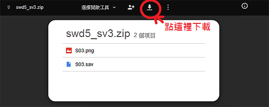

因为有玩家不太懂Google空间的档案要怎麽下载，站长在这边简单说明一下： 

## 一般下载
 
步骤一：点本站的相关载点之后，会进入类似下面这样的预览页面，请点最上面“向下箭头”图示即可下载 
 

步骤二：然后会跳出下载视窗，按确定就可以开始下载了 
 

## 当档案较大时状况比较不一样
 

步骤一： 有时候要下载的档案太大，Google不会提供预览，此时点击“下载” 
 

步骤二： Google会进一步告诉你档案太大他无法扫描，此时点击“仍要下载” 
 

步骤三： 然后会跳出下载视窗，按确定就可以开始下载了 
 
 