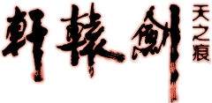
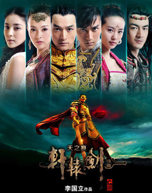
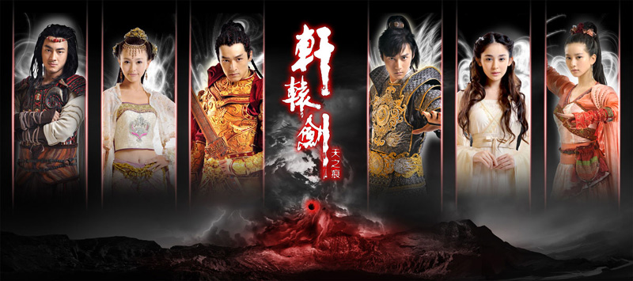
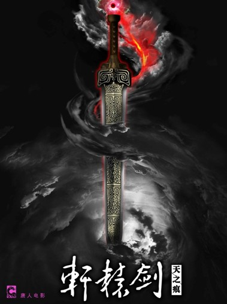

::: tip 给游戏支持者的善意提醒
任何由小说、动漫、游戏改编的作品，都会有与原作出入之处，而大部分的改编电视剧也都会有与原作差异甚大的状况，如果无法接受这些改变或更动，还请不要勉强阅读本区资料，也不要否定这部电视剧的存在，站长在此特别提醒大家。
枫舞轩辕关心您的身体健康
:::

 

## 剧情介绍
 

 
当时正值隋朝年间。北朝隋文帝，在消灭了南朝陈国后，结束了中国长期之分裂南北朝时期。陈国遗民不甘国家就此灭亡，于西元六○一年，集结了大队兵马，起兵造反，意图复国。隋文帝随即下令平定叛乱，然而让陈国反抗军惊异不已的是：隋朝的平乱部队是由不到二十人组成的，为首的竟然是一位年仅十岁的少年！ 
这位身披斗篷的神秘少年，手持神秘的“黄金之剑”，顷刻之间就将数万陈国反抗军马消灭殆尽。神秘少年以天下无敌之黄金剑（轩辕剑）立下威名，自此令所有人闻之色变，再也没人敢起兵反叛朝廷。 
十多年后，隋炀帝杨广时代──男主角陈靖仇奉师父之命，踏上寻找传说中五样上古神器旅途。陈靖仇是陈国后裔，在襁褓时代隋朝四处搜捕陈国遗族时，他的师父陈辅牺牲了自己的 孩儿，冒险将陈靖仇替代救出。陈辅将自己复国的愿望，全落在幼小的陈靖仇身上（陈靖仇之名，即是“靖北虏，复国仇”的意思）。 
陈靖仇是陈国最后一位皇子，背负著复国之命的他，十八年来没干过一件像样的事。一直在靖仇身边苦心教导他的陈国遗臣陈辅，听闻若要复国成功，最快的方法就是集合上古五大神器。陈靖仇在陈辅的督促下，身不由己的开始了寻找神器的旅程。 
但复国之路刚开始就遭遇波折，他遇到了最强的对手——北周后裔宇文拓，同样一位身负国仇家恨的皇子，两人都有著复国的使命，手段与性格却截然不同。在亦友亦敌的关係中，他们又遇到了玉儿、小雪、宁珂这三个各具特色的女孩，牵扯出複杂的感情。 
最终，维护天下和平的信念战胜了私欲，陈靖仇，宇文拓两人牺牲小爱成全大爱，联手将天之痕封印，拯救了神州大地。 

## 电视剧信息
 
 <a-descriptions size="large" :column="{xs:1, md:1, lg:1}" bordered>
 <a-descriptions-item label="名称">
轩辕剑之天之痕（电视剧）
 </a-descriptions-item>
  <a-descriptions-item label="出品制作">
上海唐人电影制作有限公司
 </a-descriptions-item>
  <a-descriptions-item label="原著">
大宇资讯股份有限公司
 </a-descriptions-item>
   <a-descriptions-item label="拍摄时间">
2011年5月13日─2011年9月23日
 </a-descriptions-item>
    <a-descriptions-item label="上星首播">
2012年7月6日（中国湖南卫视）
 </a-descriptions-item>
     <a-descriptions-item label="网络首播">
2012年7月7日（中国搜狐视频）
 </a-descriptions-item>
      <a-descriptions-item label="台湾首播">
2013年1月29日（台湾华视）
 </a-descriptions-item>
       <a-descriptions-item label="集数">
湖南卫视36集、华视30集（注一）
 </a-descriptions-item>
<a-descriptions-item label="剧集类型">
古装、魔幻、爱情、游戏改编
 </a-descriptions-item>
 </a-descriptions>
 

::: tip 注一
湖南卫视播出时，利用前情提要、下集预告、演员导言的方式拉长整体集数，因此虽然集数看起来比较多，但是剧情并没有比较多。
:::
 

 

## 出品信息
 
 <a-descriptions size="large" :column="{xs:1, md:1, lg:1}" bordered>
  <a-descriptions-item label="出品人">
林丽霞、孙莉萍	
 </a-descriptions-item>
  <a-descriptions-item label="总监制">
胡歌
 </a-descriptions-item>
  <a-descriptions-item label="总企划">
蔡艺侬
 </a-descriptions-item>
   <a-descriptions-item label="监制">
张丹
 </a-descriptions-item>
       <a-descriptions-item label="宣传推广">
藤井树（盛豔虹）、贾文风
 </a-descriptions-item>
        <a-descriptions-item label="专案推广">
梁曼仪、朱大又
 </a-descriptions-item>
 <a-descriptions-item label="发行人">
张丹
 </a-descriptions-item>
  <a-descriptions-item label="海外发行">
陈颖珊
 </a-descriptions-item>
       <a-descriptions-item label="编剧">
邓力奇、黄浩然、梁礼彦、陈十三
 </a-descriptions-item>
 <a-descriptions-item label="总导演">
李国立
 </a-descriptions-item>
  <a-descriptions-item label="导演">
梁胜权、黄俊文
 </a-descriptions-item>
 <a-descriptions-item label="制片人">
蔡艺侬
 </a-descriptions-item>
 </a-descriptions>
 

 

::: tip 注二
演员胡歌虽担任本片总监制，但仅为挂名，他以演出本片之片酬作为出资，成为本片出资人之一，并得以挂名监制，实际上并未从事监制工作。
[（2012.07.09成都商报／《轩辕剑》胡歌当制片人自曝只是挂名）](http://ent.sina.com.cn/v/m/2012-07-10/13143681192.shtml)
:::