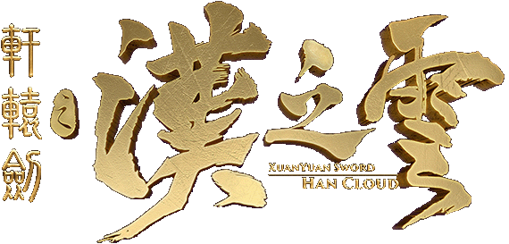
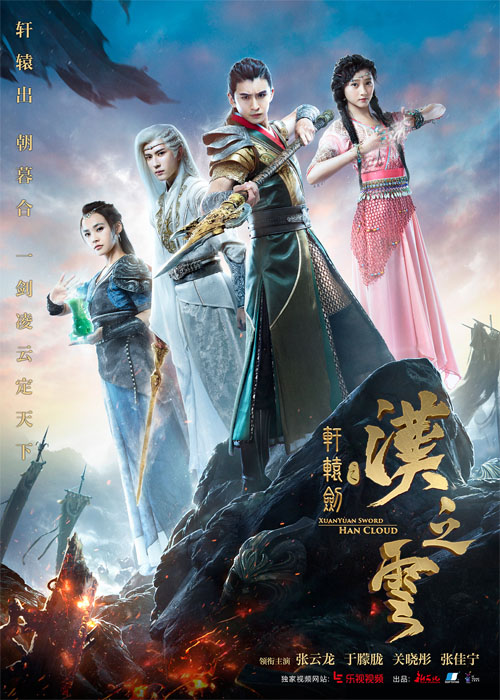
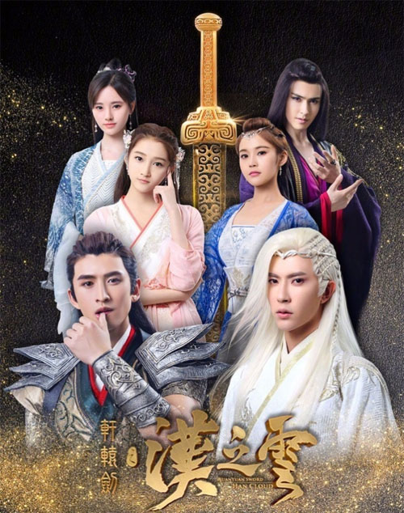

::: tip 给游戏支持者的善意提醒
任何由小说、动漫、游戏改编的作品，都会有与原作出入之处，而大部分的改编电视剧也都会有与原作差异甚大的状况，如果无法接受这些改变或更动，还请不要勉强阅读本区资料，也不要否定这部电视剧的存在，站长在此特别提醒大家。
枫舞轩辕关心您的身体健康
:::

 

## 剧情介绍
轩辕帝大败酋魔之战中，所持上古神器轩辕剑被震裂成两截，剑气也一分为二，千年后转世成为一对孪生兄弟朝云和暮云。两人因战乱自幼离散，后因缘际会，朝云为飞羽军首领焉逢，暮云则是铜雀军之神祕白衣，双方各为其主兵戎相见，全然不知彼此身世之祕，更不知因身蕴黄金剑气，早已成为酋魔残魂觊觎的对象！ 
 

 
战乱、权谋、阵法、神兵、天赋使命的四位女仙、来历奇特的郡主耶亚希。围绕著这对孪生兄弟，瑰丽雄奇的故事长卷就此展开。  

## 电视剧信息
 
 <a-descriptions size="large" :column="{xs:1, md:1, lg:1}" bordered>
 <a-descriptions-item label="名称">
轩辕剑之汉之云（电视剧）
 </a-descriptions-item>
  <a-descriptions-item label="出品制作">
上海新文化传媒集团
 （台湾大宇资讯、北京乐漾影视为共同出品公司）
 </a-descriptions-item>
  <a-descriptions-item label="原著">
大宇资讯股份有限公司
 </a-descriptions-item>
   <a-descriptions-item label="拍摄时间">
2016年5月28日─2016年9月24日（包含全部配角拍摄完毕）
 </a-descriptions-item>
    <a-descriptions-item label="上星首播">
2017年8月8日／中国上海东方卫视
 </a-descriptions-item>
     <a-descriptions-item label="网络首播">
2017年8月8日／中国北京爱奇艺科技（注一）
 </a-descriptions-item>
      <a-descriptions-item label="台湾首播">
未定
 </a-descriptions-item>
       <a-descriptions-item label="集数">
 58集
 </a-descriptions-item>
<a-descriptions-item label="剧集类型">
古装、玄幻、游戏改编
 </a-descriptions-item>
 </a-descriptions>

 ## 出品信息
 <a-descriptions size="large" :column="{xs:1, md:1, lg:1}" bordered>
 <a-descriptions-item label="出品人">
杨振华、甘薇、王建钧、龚宇	
 </a-descriptions-item>
  <a-descriptions-item label="总监制">
刘郡、凃俊光、陈雨人、王晓晖

 </a-descriptions-item>
  <a-descriptions-item label="总企划">
刘静、樊忠、王磊卿、杨向华
 </a-descriptions-item>
   <a-descriptions-item label="监制">
王绍伟、袁飞宇、李捷文
 </a-descriptions-item>
    <a-descriptions-item label="企划">
任剑伟、葛旭峰
 </a-descriptions-item>
     <a-descriptions-item label="文学企画">
孙民纪、王立民
 </a-descriptions-item>
      <a-descriptions-item label="首席编剧">
李文强
 </a-descriptions-item>
       <a-descriptions-item label="编剧">
耶马、高梦丹、梁彦龙、李悦嘉
 </a-descriptions-item>
<a-descriptions-item label="剧本统筹">
徐婷、王旭、吴军
 </a-descriptions-item>
 <a-descriptions-item label="编审">
李容
 </a-descriptions-item>
 <a-descriptions-item label="责任编辑">
宋玮、胡芊芊、辜子闻
 </a-descriptions-item>
 <a-descriptions-item label="艺术指导">
王赫、迟云祥、吴隆基
 </a-descriptions-item>
 <a-descriptions-item label="美术指导">
刘世运
 </a-descriptions-item>
 <a-descriptions-item label="造型指导">
	锺佳妮
 </a-descriptions-item>
 <a-descriptions-item label="梳妆指导">
	陈溯源
 </a-descriptions-item>
 <a-descriptions-item label="音乐总监">
谭旋
 </a-descriptions-item>
 <a-descriptions-item label="特效总监">
彭善明
 </a-descriptions-item>
 <a-descriptions-item label="动作指导">
陈伟滔、石占利
 </a-descriptions-item>
 <a-descriptions-item label="剪辑指导">
刘忆华
 </a-descriptions-item>
 <a-descriptions-item label="发行人">
王云卿
 </a-descriptions-item>
 <a-descriptions-item label="制片主任">
孟志荣、黄绘新
 </a-descriptions-item>
 <a-descriptions-item label="导演">
潘文杰、金沙、余蒨
 </a-descriptions-item>
 <a-descriptions-item label="执行制片">
刘亚东、黄雨洋
 </a-descriptions-item>
 <a-descriptions-item label="制片人">
李萍、郭玥
 </a-descriptions-item>
 <a-descriptions-item label="总制片人">
李瑛、李莅樱
 </a-descriptions-item>
 </a-descriptions>

::: tip 备注
本剧在筹募资金及早期宣传期间，原宣布网路独家首播权由“北京乐视网资讯科技”取得，惟因乐视爆发财务危机，故后期经协商后，将网路首播转交爱奇艺负责。因此部分较早的宣传图与宣传稿，仍会看到乐视字样。
:::